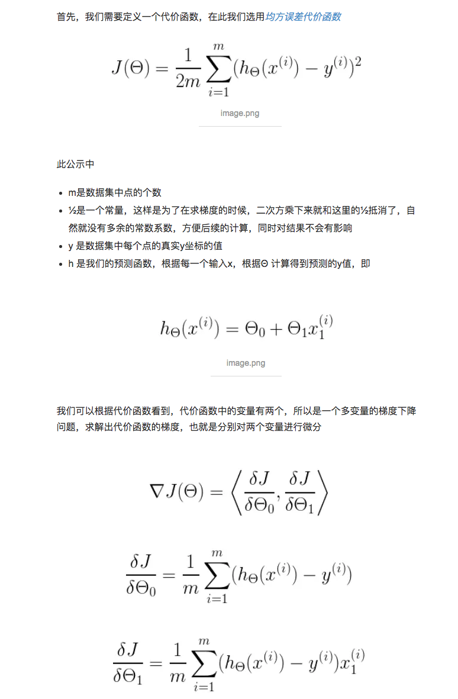
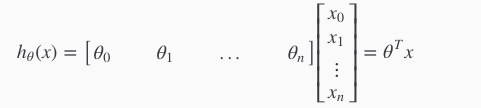

## 第一星期

Machine learning algorithms:

- Supervised learning

- Unsupervised learning

Others:

Reinforcement learning, recommender systems.

## Supervised Learning

In supervised learning, we are given a data set and already know what our correct output should look like, having the idea that there is a relationship between the input and the output.

Supervised learning problems are categorized into "regression" and "classification" problems. In a regression problem, we are trying to predict results within a continuous output, meaning that we are trying to map input variables to some continuous function. In a classification problem, we are instead trying to predict results in a discrete output. In other words, we are trying to map input variables into discrete categories.

###### Notes

> Supervised Learning refers to the fact that we gave the algorithm a data set in which the, called "right answers" were given.

## Unsupervised Learning

Unsupervised learning allows us to approach problems with little or no idea what our results should look like. We can derive structure from data where we don't necessarily know the effect of the variables.

We can derive this structure by clustering the data based on relationships among the variables in the data.

With unsupervised learning there is no feedback based on the prediction results.

## Model Representation

Regression Problem

Predict real-value output

Notation:

m = Number of training examples

x's = "input" variable / features

y's = "output" variable / "target" variable

### Cost Function（Loss Function）

[中文介绍](https://www.zhihu.com/question/52398145)

We can measure the accuracy of our hypothesis function by using a **cost function**.

###### Notes

我们使用代价函数来判断模型与训练集的拟合度，而常用的代价函数为平方差（Squared error function / Mean squared error）。

关于训练集的**平均损失**称作经验风险(empirical risk)，我们的目标就是让平均损失最小化，称为**经验风险最小化**。

我们不仅要让经验风险最小化，还要让**结构风险最小化**。这个时候就定义了一个函数 J(f)，这个函数专门用来度量**模型的复杂度**，在机器学习中也叫正则化(regularization)。常用的有L1, L2范数。

最优化经验风险和结构风险，而这个函数就被称为**目标函数**。

### Gradient Descent 梯度下降

使用微分（导数）来找出局部最优解

###### 问题1

代价函数中的变量，微分的过程？

回答

[详解梯度下降法求解线性模型参数](https://blog.csdn.net/ybdesire/article/details/52895274)

## 第二星期

### Multiple Features

X使用下标表示变量们
n代表变量的数量
x带括号上标依然代表第几个样本的变量 => 矩阵（n纬向量）
x同时含有上下标代表具体的样本，具体的变量

我们的假设函数

#### Gradient Descent for Multiple Variables

为了让梯度下降收敛的更快，我们可以对样本中的特征值进行处理。

我们让特征值的值处于 -1 到 1的区间，或者 -0.5 到 0.5的区间。

前者需要每一个特征值除以最大特征值与最小特征值之间的差(变量的标准差)，后者需要每一个特征值减去特征值的平均值后除以最大特征值与最小特征值之间的差(变量的标准差)。

#### Gradient Descent in Practice II - Learning Rate

If\alphaαis too small: slow convergence.

If\alphaαis too large: may not decrease on every iteration and thus may not converge.
