## 第一星期

Machine learning algorithms:

- Supervised learning

- Unsupervised learning

Others:

Reinforcement learning, recommender systems.

#### Supervised Learning

In supervised learning, we are given a data set and already know what our correct output should look like, having the idea that there is a relationship between the input and the output.

Supervised learning problems are categorized into "regression" and "classification" problems. In a regression problem, we are trying to predict results within a continuous output, meaning that we are trying to map input variables to some continuous function. In a classification problem, we are instead trying to predict results in a discrete output. In other words, we are trying to map input variables into discrete categories.

###### Notes

> Supervised Learning refers to the fact that we gave the algorithm a data set in which the, called "right answers" were given.

#### Unsupervised Learning

Unsupervised learning allows us to approach problems with little or no idea what our results should look like. We can derive structure from data where we don't necessarily know the effect of the variables.

We can derive this structure by clustering the data based on relationships among the variables in the data.

With unsupervised learning there is no feedback based on the prediction results.

#### Model Representation

Regression Problem

Predict real-value output

Notation:

m = Number of training examples

x's = "input" variable / features

y's = "output" variable / "target" variable

### Cost Function（Loss Function）

[中文介绍](https://www.zhihu.com/question/52398145)

We can measure the accuracy of our hypothesis function by using a **cost function**.

###### Notes

我们使用代价函数来判断模型与训练集的拟合度，而常用的代价函数为平方差（Squared error function / Mean squared error）。

关于训练集的**平均损失**称作经验风险(empirical risk)，我们的目标就是让平均损失最小化，称为**经验风险最小化**。

我们不仅要让经验风险最小化，还要让**结构风险最小化**。这个时候就定义了一个函数 J(f)，这个函数专门用来度量**模型的复杂度**，在机器学习中也叫正则化(regularization)。常用的有L1, L2范数。

最优化经验风险和结构风险，而这个函数就被称为**目标函数**。

### Gradient Descent 梯度下降

使用微分（导数）来找出局部最优解

###### 问题1

代价函数中的变量，微分的过程？

回答

[详解梯度下降法求解线性模型参数](https://blog.csdn.net/ybdesire/article/details/52895274)

## 第二星期

### Multiple Features

X使用下标表示变量们
n代表变量的数量
x带括号上标依然代表第几个样本的变量 => 矩阵（n纬向量）
x同时含有上下标代表具体的样本，具体的变量

我们的假设函数

#### Gradient Descent for Multiple Variables

为了让梯度下降收敛的更快，我们可以对样本中的特征值进行处理。

我们让特征值的值处于 -1 到 1的区间，或者 -0.5 到 0.5的区间。

前者需要每一个特征值除以最大特征值与最小特征值之间的差(变量的标准差)，后者需要每一个特征值减去特征值的平均值后除以最大特征值与最小特征值之间的差(变量的标准差)。

#### Gradient Descent in Practice II - Learning Rate

If a(alpha) too small: slow convergence.

If a(aloha) too large: may not decrease on every iteration and thus may not converge.

#### Features and Polynomial Regression

我们可以处理我们的特征值来适应不同的模型。

#### Normal Equation正规方程

对代价函数微分，并使导数为0，则可计算出最优解，如果是多元的，则需重复计算。

使用正规方程则可以直接计算出最优解。

The following is a comparison of gradient descent and the normal equation:

| Gradient Descent           | Normal Equation                                |
| -------------------------- | ---------------------------------------------- |
| Need to choose alpha       | No need to choose alpha                        |
| Needs many iterations      | No need to iterate                             |
| O (kn^2kn2)                | O (n^3n3), need to calculate inverse ofX^TXXTX |
| Works well when n is large | Slow if n is very large                        |

With the normal equation, computing the inversion has complexity\mathcal{O}(n^3)O(n3). So if we have a very large number of features, the normal equation will be slow. In practice, when n exceeds 10,000 it might be a good time to go from a normal solution to an iterative process.

#### Normal Equation Noninvertibility

因为要计算逆矩阵，但不是所有的矩阵都可逆，所以有一些情况可能导致不可逆。

1. 特征值是冗余的（redundant），删掉一些就好。

2. 特征值太多，多到接近于训练样本，这个时候考虑使用regularization（后面的课程会说）或者删掉一些。

括号中，大写代表上标吧，小写代表下标，同时存在则使用-分开

if X(T) * X is **noninvertible,**the common causes might be having :

- Redundant features, where two features are very closely related (i.e. they are linearly dependent)
- Too many features (e.g. m ≤ n). In this case, delete some features or use "regularization" (to be explained in a later lesson).

## 第三星期

#### Classification

介绍了线性回归算法为什么不适用于分类。

#### Hypothesis Representation

Our new form uses the "Sigmoid Function," also called the "Logistic Function":

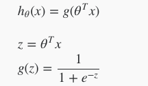

The following image shows us what the sigmoid function looks like:

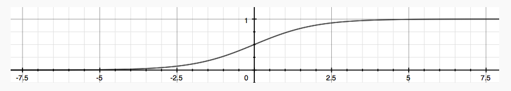

Sigmoid or Logistic Function可以算出，给定参数，Y = 1的概率R1，或着Y = 0的概率R2，因为只分两类，所以 1 = R1 + R2

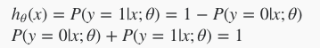

#### Decision Boundary

我们可以根据z = 0来得出分界线的函数，这个函数可能是一条线，或者一个圈，还有个各种功能奇怪的形状。

#### Cost Function

如果使用线性回归的平方差代价函数，那么代价函数不是一个凸函数，所以使用了一个新的代价函数。

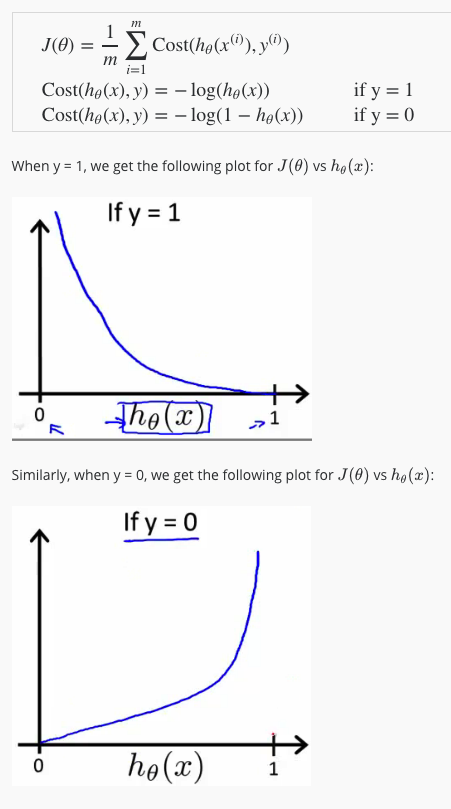

#### Simplified Cost Function and Gradient Descent

上一节的分段表达式可以写为下图，因为y只有0，1两种取值，所以这种写法等价于上面的分段写法。

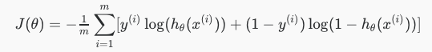

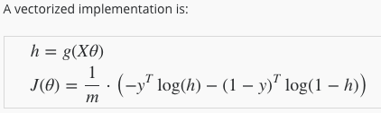

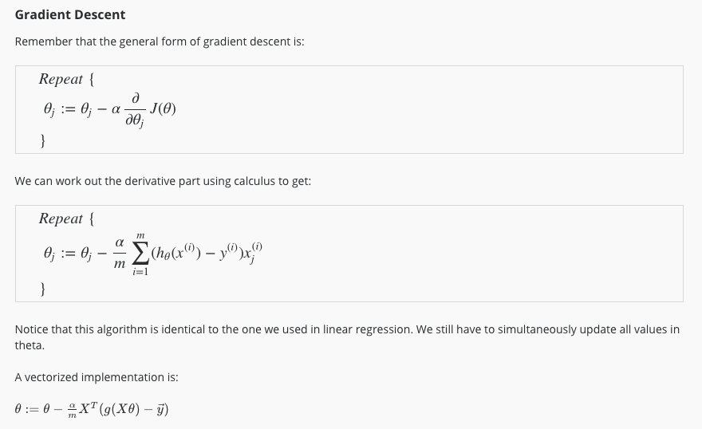

#### Advanced Optimization

在线性回归里面说过，我们可以通过归一化我们的特征值或者选取合适的学习速率来让梯度下降更快。

这一节讲述了比梯度下降更高级的算法，这些算法效率很高。

"Conjugate gradient", "BFGS", and "L-BFGS" are more sophisticated, faster ways to optimize θ that can be used instead of gradient descent. We suggest that you should not write these more sophisticated algorithms yourself (unless you are an expert in numerical computing) but use the libraries instead, as they're already tested and highly optimized. Octave provides them.

在Octave中调用时，我们只需要提供代价函数，以及代价函数的偏导数的计算方法，则可以调用这些高级的算法。

***别问，问就要思考十年！***

#### Multiclass Classification: One-vs-all

我们可以把多分类问题变成只有两种结果的分类问题。

比如我们现在有n中结果，我们从i开始，分别把i作为一种结果，除了i的其他所有结果为一种结果，写出一个假设函数，重复n次。

当我们需要分类时，只需把参数带入我们n个假设函数中，得到的结果最大的那个为本次预测结果。

Now we will approach the classification of data when we have more than two categories. Instead of y = {0,1} we will expand our definition so that y = {0,1...n}.

Since y = {0,1...n}, we divide our problem into n+1 (+1 because the index starts at 0) binary classification problems; in each one, we predict the probability that 'y' is a member of one of our classes.

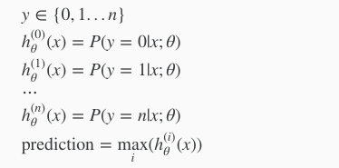

We are basically choosing one class and then lumping all the others into a single second class. We do this repeatedly, applying binary logistic regression to each case, and then use the hypothesis that returned the highest value as our prediction.

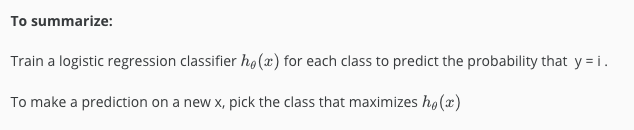

### Solving the Problem of Overfitting

#### The Problem of Overfitting

This terminology is applied to both linear and logistic regression. There are two main options to address the issue of overfitting:

1) Reduce the number of features:

- Manually select which features to keep.
- Use a model selection algorithm (studied later in the course).

2) Regularization

- Keep all the features, but reduce the magnitude of parameters theta(j)
- Regularization works well when we have a lot of slightly useful features.

#### Cost Function

过度拟合导致了对数据集的适配非常好，却不能应用到实际问题中，通过在代价函数中加入对 theta 的一点制约，来减少过度拟合的出现。

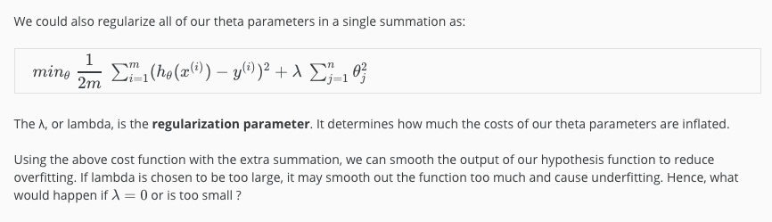

#### Regularized Linear Regression

添加了对参数的制约后，求解的步骤变化了一些

我们一般不惩罚theta0， 在算法实现上，可以把theta0 = 0，这样0^2 = 0

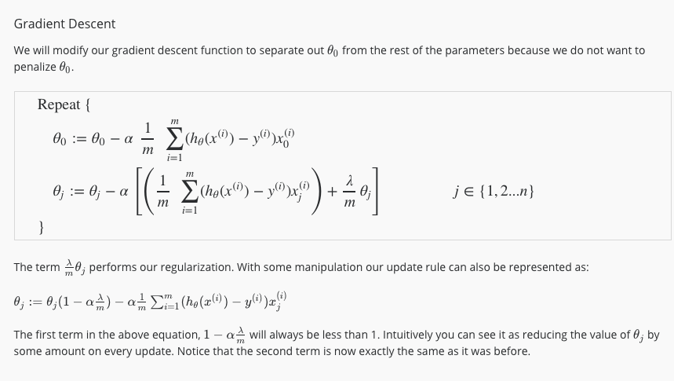

正规方程中，添加了lambda之后，所有矩阵都可逆了。

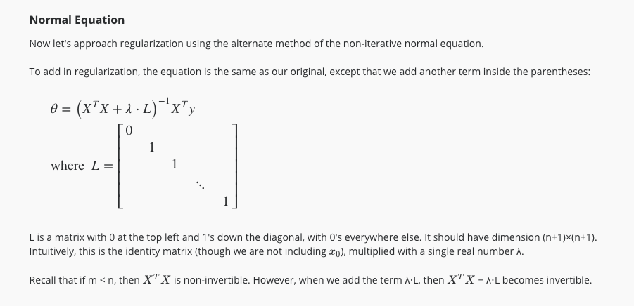

#### Regularized Logistic Regression

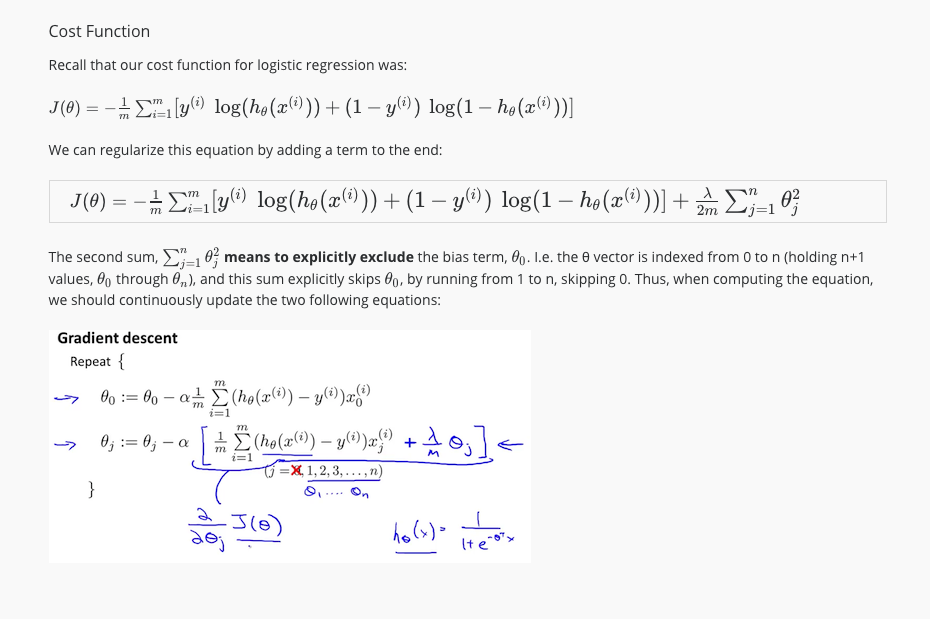

同线性回归一样，我们不惩罚theta0。

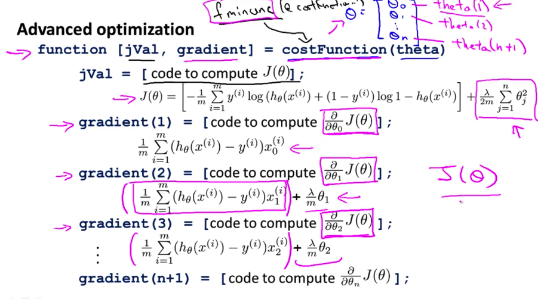

不会微分好伤心，截个图死记硬背先。
